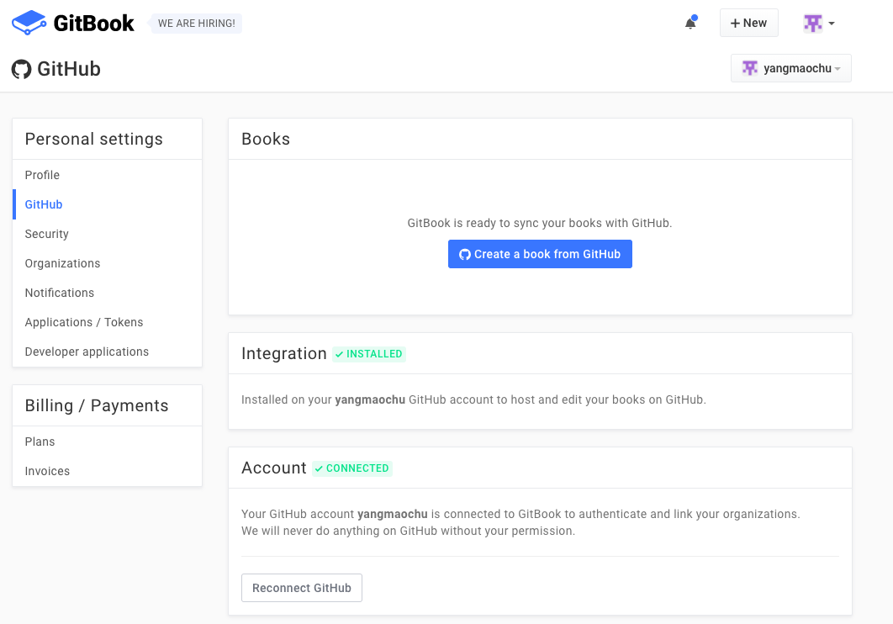
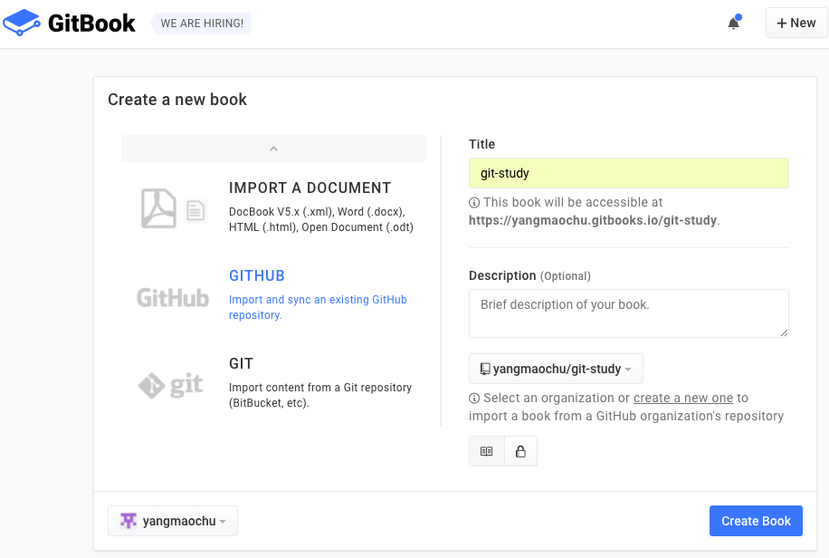

# 新建书籍

## 从零开始新建第一本书(gitbook-study)

新建一本可以直接在线阅读的GitBook书籍有很多种方式,在这里不打算一一介绍,本文以一个新手的视角,从零开始用新建账号yangmaochu@hotmail.com完成名为gitbook-study书籍的新建,很多步骤和思路其它方式均可以借鉴.

1. 在[GitHub](https://github.com/login)中新建账号.
2. 在GitHub中新建一个仓库,相关信息填写如下图:

3. 在[GitBook](https://www.gitbook.com/)中选择用GitHub账号登陆,登陆成功后,在GitHub的Setting-Application-Authorized OAuth Apps中将增加一个针对GitBook账户授权,如下图:

4. 在GitBook的Account Settings-GitHub-Integration中选择Install GitHub integration on this account,如下图:

完成后,在GitHub的Setting-Application-Installed GitHub Apps中将增加一个GitBook应用,如下图:

5. 在GitBook的Account Settings-Books中选择Create a book from GitHub,如下图:

选择在GitHub中建立的仓库,同时使用一样的名字:

完成后见下图:

第5步完成后,实际上整个动作已经完成,后续对书籍的编辑主要有两种方式:

1. clone在GitHub上的仓库,然后用自己喜欢的工具进行编辑,当推送新增内容到GitHub上时,GitHub会自动同步到GitBook.
2. 下载[GitBook Editor](https://www.gitbook.com/editor),用GitHub账号登陆后,可以直接编辑,编辑内容自动会同步到GitHub仓库.

## 新建第二本书籍(git-study)

1. 在GitHub中新建一个仓库.
2. 在[GitBook](https://www.gitbook.com/new)中新建一本同名的书,新建类型选择为"GITHUB"如下图:

